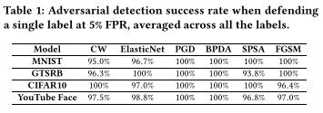
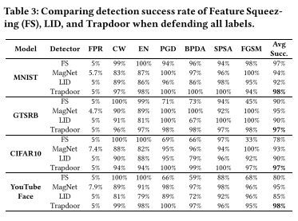
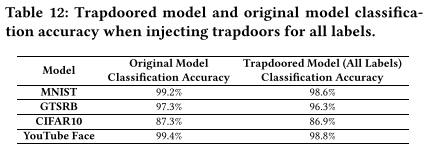

# Gotta Catch ’Em All: Using Honeypots to Catch Adversarial Attacks on Neural Networks

- Link: Proceedings
  - [x] First pass
  - [ ] Second pass
  - [ ] Third pass
- Key-points:
  - Intentionally create weak spots (honeypot) inside model to lure attackers.
  - Adversarial examples created by attackers will then have similar representation. Reject all input that have similar representation as trapdoor.
  - This method has negligible effect on the clean accuracy
  - adversarial examples computed from the resulting clean model do not transfer to the trapdoored models of interest (§7.1).
- Dataset:

  - MNIST
  - GTSRB
  - CIFAR10
  - YouTube Face
- Performance:

