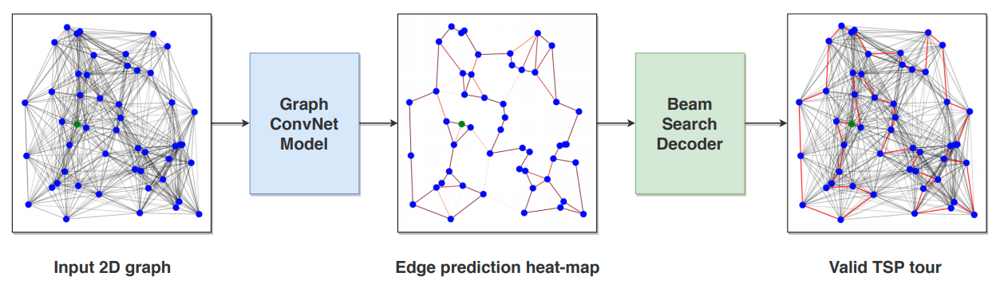

# An Efficient Graph Convolutional Network Technique For The Travelling Salesman Problem

- Link: https://arxiv.org/pdf/1906.01227.pdf
  - [x] First pass
  - [x] Second pass
  - [ ] Third pass
- Key-points:

- Dataset:
  - Independent dataset labeled with concorde solver.