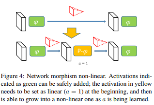

# Network Morphism

- Link: https://arxiv.org/pdf/1603.01670.pdf
  - [x] First pass
  - [ ] Second pass
  - [ ] Third pass
- Key-points:
  - Morph a network into a bigger network while maintaining the learned knowledge
  - For linear case: simply use matrix decomposition
  - For nonlinear case:
    - Introduce the concept of P(arametric)-activation function family:
    - 
    - The added activation function is first set as linear (a=1), and then will grow to a non-linear activation as a is learned (see figure below)
    - 
- Performances:
