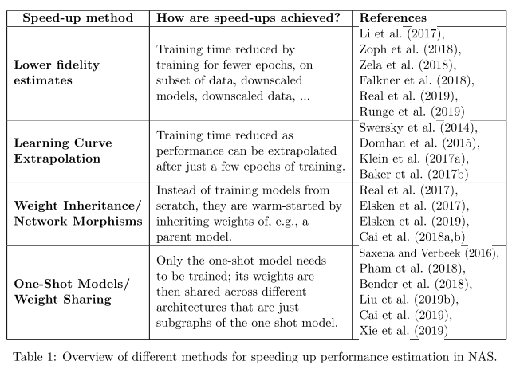

# Neural Architecture Search: A Survey

- Link: https://www.jmlr.org/papers/volume20/18-598/18-598.pdf
  - [x] First pass
  - [x] Second pass
  - [x] Third pass
- Key-points:
  - **Search space**: The search space defines which neural architectures a NAS approach might discover in
  principle
    - **Chain-structured neural networks**: simple sequentially-stacked NN
    - **Multi-branch networks**: incorporates more complex design e.g. skip connection. 
    - **Cells or blocks search**: [Zoph et al. (2018)](https://arxiv.org/pdf/1707.07012.pdf) and [Zhong et al. (2018)](https://arxiv.org/pdf/1708.05552.pdf), Search for **cells** or **blocks** architectures, respectively, instead of searching the whole architecture. 
      - **Advantages**:
        - The size of the search space is drastically reduced since cells usually consist of significantly less layers than whole architectures (Zoph estimate a 7-times speed-up)
        - Architectures built from cells can more easily be transferred or adapted to other data sets by simply varying the number of cells and filters used within a model
        - Creating architectures by repeating building blocks has proven a useful design principle in general, such as repeating an LSTM block in RNNs or stacking a residual block.
      - **=> But how do we choose the macro-architecture?** 
        - [Zoph et al. (2018)](https://arxiv.org/pdf/1707.07012.pdf) used sequential model
        - [Cai et al. (2018b)](https://arxiv.org/abs/1806.02639) employ the architecture of well-known model, e.g. DenseNet
        - [Liu et al. (2018b)](https://arxiv.org/abs/1711.00436) hierarchical search space
  - **Search strategy**:
    - Random search, Bayesian optimization, evolutionary methods, reinforcement learning (RL), and gradient-based methods
    - GAs were already used decades ago
    - Bayesian optimization celebrated several early successes in NAS since 2013
    - NAS became a mainstream research topic in the machine learning community after Zoph and Le (2017) obtained competitive performance on the CIFAR-10 and Penn Treebank benchmarks with a search strategy based on reinforcement learning (but use 800 GPUs for three to four weeks)
    - Neuro-evolutionary methods differ in how they sample parents, update populations,
      and generate offspring:
      - Sample parents methods:
        - Tournament selection
        - multi-objective Pareto front using an inverse density
        - remove the worst individual from a population
        - remove the oldest individual
        - do not remove individuals at all
      - Generate offspring:
        - Initialize randomly
        - Lamarckian inheritance, i.e, knowledge (in the form of learned weights) is passed on from a parent network to its children by using network morphisms
    - Comparison:
      - RL and evolution perform equally well in terms of final test accuracy, with evolution having better anytime performance and finding smaller models
      - Both above approaches consistently perform better than RS in their experiments, but with a rather small margin (RL + evolution got 3.5% error rate. RS got 4% error rate)
      - Bayesian Optimization (BO) is one of the most popular methods for hyperparameter optimization, but it has not been applied to NAS by many groups since typical BO toolboxes are based on Gaussian processes and focus on low-dimensional continuous optimization problems.
      - Negrinho and Gordon (2017) and Wistuba (2017) exploit the tree-structure of their
        search space and use Monte Carlo Tree Search.
      - Elsken et al. (2017) propose a simple yet well performing hill climbing algorithm that
      - Liu et al. (2019b) propose a continuous relaxation to enable direct gradient-based optimization
  - **Performance estimation strategy**:
    - 

